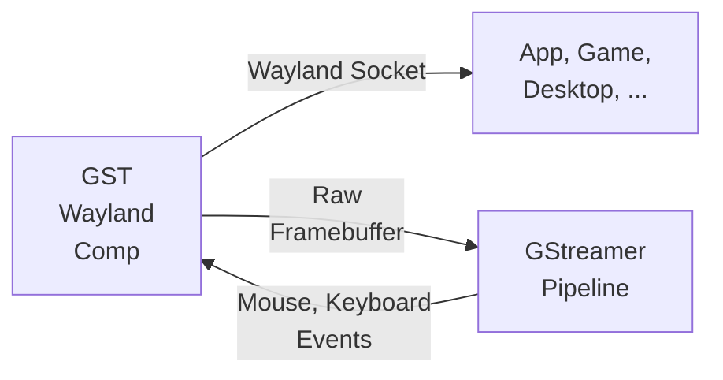

# gst-wayland-display

A micro Wayland compositor that can be used as a Gstreamer plugin. Based
on [smithay](https://github.com/Smithay/smithay)



## Install

see [cargo-c](https://github.com/lu-zero/cargo-c)

```bash
git clone https://github.com/games-on-whales/gst-wayland-display.git
cd gst-wayland-display
# Install cargo-c if you don't have it already
cargo install cargo-c
# Build and install the plugin, by default under 
cargo cinstall --prefix=/usr/local
```

## GStreamer plugin

By default it'll install the plugin in `/usr/local/lib/gstreamer-1.0/libgstwaylanddisplaysrc.so`.

You can check if the plugin is picked up by calling:

```bash
GST_PLUGIN_PATH=/usr/local/lib/gstreamer-1.0 gst-inspect-1.0 waylanddisplaysrc
```

Example pipeline:

```bash
GST_PLUGIN_PATH=/usr/local/lib/gstreamer-1.0 gst-launch-1.0 waylanddisplaysrc ! 'video/x-raw,width=1280,height=720,format=RGBx,framerate=60/1' !  autovideosink
```

If this starts you should have a wayland socket under `$XDG_RUNTIME_DIR`

```
ls $XDG_RUNTIME_DIR 
 wayland-1
 wayland-1.lock
```

You should then be able to start any wayland process and use that socket

```bash 
WAYLAND_DISPLAY=wayland-1 weston-simple-egl
```

## Zero copy pipeline support

This plugin supports outputting **DMA buffers** in order to achieve a proper **zero-copy pipeline**.  
It'll negotiate the proper caps with downstream elements using Gstreamer, you can read more about
it [in the official docs](https://gstreamer.freedesktop.org/documentation/additional/design/dmabuf.html?gi-language=c).

Example pipelines:

- AMD/Intel

```bash
gst-launch-1.0 waylanddisplaysrc ! 'video/x-raw(memory:DMABuf),width=1920,height=1080,framerate=60/1' ! vapostproc ! 'video/x-raw(memory:VAMemory), format=NV12' ! vah265enc ! vah265dec ! autovideosink
```

- Nvidia (or see below for an even better pipeline that uses CUDAMemory)

```bash
gst-launch-1.0 waylanddisplaysrc  ! 'video/x-raw(memory:DMABuf),width=1920,height=1080,framerate=60/1' ! glupload ! glcolorconvert ! 'video/x-raw(memory:GLMemory), format=NV12' ! nvh265enc ! nvh265dec ! autovideosink
```

### Support for Nvidia CUDAMemory

> [!IMPORTANT]
> This is gated behind the `cuda` feature flag. To enable it, you'll need to install `gst-cuda-1.0` and have access to
> `libcuda.so` at runtime.

This plugin supports outputting **CUDA buffers** for low-latency Nvidia pipelines. By not using `glupload` and
`glcolorconvert` we can not only be way more efficient, but it'll also allow us to re-use the GL context that we already
have in Smithay.

It can negotiate the CUDA Context with other elements in the pipeline, or it can be a source for other elements when
setting the property`cuda-device-id`. This is particularly useful when running in a multi-GPU environment as it gives
you full control over which GPU is used.

Example pipeline:

```bash 
gst-launch-1.0 waylanddisplaysrc cuda-device-id=0 ! 'video/x-raw(memory:CUDAMemory),width=1920,height=1080,framerate=60/1' ! nvh265enc ! nvh265dec ! autovideosink
```

In order to support this we leverage `gst-cuda-1.0` which adds a single build dependency to this project.
At runtime, you'll need to have access to `libcuda.so` but only to access and use `CUDAMemory`; you can still use
`DMABuf` when running this plugin on a platform that doesn't support it.

## Vulkan encode

Setting `vulkan=true` offers NV12 and P010 as `memory:VulkanImage`. The source harvests the
downstream encoder's `GstVulkanDevice` through a `gst.vulkan.device` context query and mints its
output images on that same device, so `vulkanh264enc` (NV12, 8-bit) and `vulkanh265enc` (P010,
Main-10) can view them with no copy. The RGBA to NV12/P010 conversion runs as a Vulkan compute
shader on the encoder's device.

```bash
gst-launch-1.0 waylanddisplaysrc vulkan=true render-node=/dev/dri/renderD128 \
  ! 'video/x-raw(memory:VulkanImage),format=NV12,width=1920,height=1080' \
  ! vulkanh264enc ! h264parse ! fakesink
```

> [!IMPORTANT]
> `vulkanh265enc` is not an upstream GStreamer element. It ships as `patches/vulkanh265enc.patch`
> and has to be applied to the GStreamer tree before building; see `patches/README.md`. The
> `docker/vulkan.Dockerfile` image applies it for you.

Pin `width` and `height` in the caps. Left open, the source fixates to 1x1 and negotiation settles
on whatever minimum the chosen encoder advertises, which is codec-specific: `vulkanh264enc` accepts
from 128x128 and `vulkanh265enc` from 130x128 on this driver. Both produce a valid stream, just not
at the size you probably wanted.

## Environment variables

These are read once at startup. Everything here is off or neutral when unset, so the default
behaviour is what you get without setting any of them. The diagnostic ones exist for tracking
driver bugs and are not intended for normal use.

HDR and colour, all inert unless `WOLF_HDR_CM` is set:

| Variable | Default | Effect |
| --- | --- | --- |
| `WOLF_HDR_CM` | unset | Advertise `wp_color_manager_v1` and `frog_color_management_v1`, and pick the PQ-passthrough shader per frame when a client submits already-PQ 10-bit content. Gates every other entry in this table. |
| `WOLF_HDR_PEAK_NITS` | `1000` | Display peak luminance advertised to the client through frog, in nits. Match it to the target TV. Max-full-frame is derived as 40% of it. |
| `WOLF_SDR_REFERENCE_WHITE` | `203` | SDR diffuse white in nits for the BT.2020/PQ tone-map, bound to specialization constant 0 of the converter pipelines. 203 is BT.2408 graphics white. |
| `WOLF_HDR_MASTERING` | computed | Override the mastering-display-info string on the output caps. GStreamer format: R:G:B:W chroma coordinates scaled by 50000, then max:min luminance in 0.0001 cd/m². |
| `WOLF_HDR_CLL` | computed | Override content-light-level as `maxCLL:maxFALL` in cd/m². |

Vulkan encode:

| Variable | Default | Effect |
| --- | --- | --- |
| `WOLF_VULKAN_LINEAR_ENCSRC` | unset | Allocate the encode-src image `LINEAR` instead of tiled. Works around a radv GFX12/RDNA4 bug that corrupts a LINEAR to tiled `vkCmdCopyImage`. Falls back to tiled if the LINEAR allocation is rejected. |
| `WOLF_VULKAN_RING` | `4` | Number of encode-src ring slots cycled, 1 to 4. `1` pins a single slot, which isolates whether per-slot image addresses are behind a tiling artifact. |

Diagnostics:

| Variable | Default | Effect |
| --- | --- | --- |
| `WOLF_VULKAN_DUMP` | unset | Path to write one raw NV12 frame of the converter's output, taken before the encode-src copy. Distinguishes conversion corruption from downstream corruption. |
| `WOLF_VULKAN_DUMP_FRAME` | `20` | Which frame `WOLF_VULKAN_DUMP` captures. Raise it to let a client connect and paint first. |
| `WOLF_HDR_SPIKE` | unset | Draw synthetic above-1.0 brightness bars across the top of the output and read the framebuffer back once, to check whether GLES preserved or clamped them. Changes what is rendered, so do not leave it set. |

## Run without a GPU

If you don't have a GPU, you can still run this plugin without it; just use the option `render_node=software` to enable it. Example pipeline:
```bash 
gst-launch-1.0 waylanddisplaysrc render_node=software ! 'video/x-raw,width=1280,height=720,format=RGBx,framerate=60/1' !  videoconvert ! autovideosink
```

## Mouse and Keyboard

To pass mouse and keyboard events to the Wayland compositor you have two options: 
 - Pass two valid input devices to the plugin using the `keyboard` or `mouse` options (ex: `waylanddisplaysrc keyboard=/dev/input/event20 mouse=/dev/input/event21`)
 - Send the inputs as raw events to the Gstreamer pipeline

For example, here's [how Wolf sends the mouse movements](https://github.com/games-on-whales/wolf/blob/b4c4571b061cd243a4606bd16969c235767d6ec2/src/core/src/platforms/linux/virtual-display/gst-wayland-display.cpp#L45-L53) to gst-wayland-comp:
```c++
  auto msg = gst_structure_new("MouseMoveRelative",
                                "pointer_x", G_TYPE_DOUBLE, static_cast<double>(delta_x),
                                "pointer_y", G_TYPE_DOUBLE, static_cast<double>(delta_y),
                                NULL);
  gstreamer::send_message(w_state->wayland_plugin.get(), msg);
```

Mouse, Keyboard and Touch events are supported by the plugin. 


## C Bindings

CmakeLists.txt

```cmake
pkg_check_modules(libgstwaylanddisplay REQUIRED IMPORTED_TARGET libgstwaylanddisplay)
target_link_libraries(<YOUR_PROJECT_HERE> PUBLIC PkgConfig::libgstwaylanddisplay)
```

Include in your code:

```c
#include <libgstwaylanddisplay/libgstwaylanddisplay.h>
```

Example usage:

```c++
auto w_state = display_init("/dev/dri/renderD128"); // Pass a render node
        
display_add_input_device(w_state, "/dev/input/event20"); // Mouse
display_add_input_device(w_state, "/dev/input/event21"); // Keyboard

// Setting video as 1920x1080@60
auto video_info = gst_caps_new_simple("video/x-raw",
                                  "width", G_TYPE_INT, 1920,
                                  "height", G_TYPE_INT, 1080,
                                  "framerate", GST_TYPE_FRACTION, 60, 1,
                                  "format", G_TYPE_STRING, "RGBx",
                                  NULL);
display_set_video_info(w_state, video_info);

// Get a list of the devices needed, ex: ["/dev/dri/renderD128", "/dev/dri/card0"]
auto n_devices = display_get_devices_len(w_state);
const char *devs[n_devices];
display_get_devices(w_state, devs, n_devices);

// Get a list of the env vars needed, notably the wayland socket
// ex: ["WAYLAND_DISPLAY=wayland-1"]
auto n_envs = display_get_envvars_len(w_state);
const char *envs[n_envs];
display_get_envvars(w_state, envs, n_envs);

// Example of polling for new video data
GstBuffer * v_buffer;
while(true){
  v_buffer = display_get_frame(w_state);
  // TODO: do something with the video data
}

display_finish(w_state); // Cleanup
```